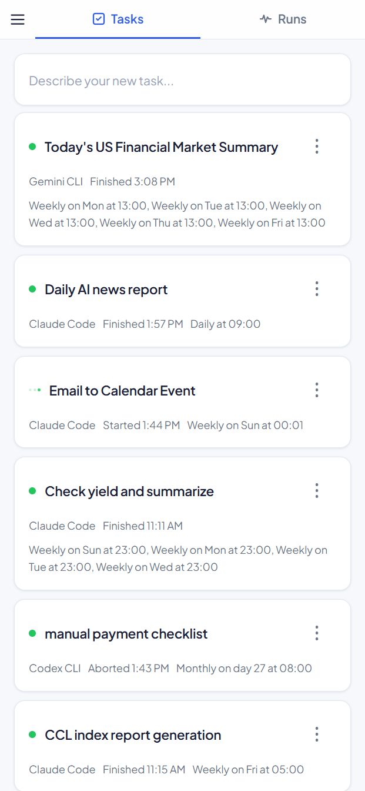

# Palmier

[](https://github.com/caihongxu/palmier/actions/workflows/ci.yml)
[](https://www.npmjs.com/package/palmier)
[](https://github.com/caihongxu/palmier/blob/master/LICENSE)

**Website:** [palmier.me](https://www.palmier.me) | **App:** [app.palmier.me](https://app.palmier.me)

You have AI agents on your machine. But you have to sit at your desk to use them. Palmier lets you dispatch, schedule, and monitor them from your phone — or anywhere.

It runs on your machine as a background daemon and connects to a mobile-friendly PWA, so you can create tasks, approve permissions, and check results without being at your computer.

<p align="center">
  
</p>

> **Important:** By using Palmier, you agree to the [Terms of Service](https://www.palmier.me/terms) and [Privacy Policy](https://www.palmier.me/privacy). See the [Disclaimer](#disclaimer) section below.

## Quick Start

1. Install a supported agent CLI — [Claude Code](https://docs.anthropic.com/en/docs/claude-code), [Gemini CLI](https://github.com/google-gemini/gemini-cli), [Codex CLI](https://github.com/openai/codex), [GitHub Copilot](https://github.com/github/gh-copilot), or [others](https://www.palmier.me/agents).
2. Install Palmier:
   ```bash
   npm install -g palmier
   ```
3. Run the setup wizard from your Palmier root directory (e.g., `~/palmier`):
   ```bash
   palmier init
   ```
   This detects your agents, configures access, installs the background daemon, and starts pairing.
4. Open `http://localhost:<port>` to access the app locally — no pairing needed.
5. To access from other devices, enter the OTP code shown after init into the PWA.

### Prerequisites

- **Node.js 24+**
- **Linux with systemd** or **Windows 10/11** (macOS coming soon)
- At least one supported agent CLI

## How It Works

- The host runs as a **background daemon** (systemd user service on Linux, Task Scheduler on Windows), staying alive via `palmier serve`.
- **Tasks** are stored locally as Markdown files. Each task has a prompt, execution plan, and optional schedules.
- **Plan generation** is automatic — when you create or update a task, the host invokes your chosen agent CLI to generate an execution plan and name.
- **Schedules** are backed by systemd timers (Linux) or Task Scheduler (Windows). You can enable/disable them without deleting the task, and any task can still be run manually at any time.
- **Command-triggered tasks** — optionally specify a shell command (e.g., `tail -f /var/log/app.log`). Palmier runs the command continuously and invokes the agent for each line of stdout, passing it alongside your prompt. Useful for log monitoring, event-driven automation, and reactive workflows.
- **Agent HTTP endpoints** — the daemon exposes localhost-only endpoints (`/notify`, `/request-input`) that agents call to send push notifications and request user input during task execution.

## Access Modes

Local always works. Enable LAN and/or Server mode during `palmier init`.

| Mode | Transport | URL | Pairing | Features |
|------|-----------|-----|---------|----------|
| **Local** | HTTP (localhost) | `http://localhost:<port>` | Not required | Full access from the host machine, no internet needed |
| **LAN** | HTTP (direct) | `http://<host-ip>:<port>` | Required | Access from other devices on the local network |
| **Server** | Cloud relay (NATS) | `https://app.palmier.me` | Required | Push notifications, remote access from anywhere |

**LAN mode** binds the daemon to `0.0.0.0` so the PWA is accessible from other devices on your network. Devices must pair via OTP.

**Server mode** relays communication through the Palmier cloud server (via [NATS](https://nats.io)). All features including push notifications are available. Server mode and LAN mode can be active at the same time.

## Setup Details

### Pairing Devices

Local access (`http://localhost:<port>`) works immediately — no pairing needed.

For LAN or server mode, run `palmier pair` on the host to generate an OTP code. Enter it in the PWA — either at `http://<host-ip>:<port>` (LAN mode) or `https://app.palmier.me` (server mode).

### Managing Clients

```bash
# List all paired devices
palmier clients list

# Revoke a specific device's access
palmier clients revoke <token>

# Revoke all clients (unpair all devices)
palmier clients revoke-all
```

### The `init` Command

The wizard:
- Detects installed agent CLIs and caches the result
- Configures access modes (HTTP port, LAN access)
- Shows a summary (including any existing scheduled tasks to recover) and asks for confirmation
- Registers with the Palmier server, saves configuration to `~/.config/palmier/host.json`
- Installs a background daemon (systemd user service on Linux, Task Scheduler on Windows)
- Auto-enters pair mode to connect your first device

The daemon automatically recovers existing tasks by reinstalling their system timers on startup.

Agents are re-detected on every daemon start. Run `palmier restart` after installing or removing a CLI.

### Verifying the Service

After `palmier init`, verify the host is running:

**Linux:**

```bash
# Check service status
systemctl --user status palmier.service

# View recent logs
journalctl --user -u palmier.service -n 50 --no-pager

# Follow logs in real time
journalctl --user -u palmier.service -f
```

**Windows (PowerShell):**

```powershell
# Check if the daemon is running
Get-Process -Name node -ErrorAction SilentlyContinue | Where-Object { $_.CommandLine -like '*palmier*serve*' }
```

**Restarting the daemon (both platforms):**

```bash
palmier restart
```

## CLI Reference

| Command | Description |
|---|---|
| `palmier init` | Interactive setup wizard |
| `palmier pair` | Generate an OTP code to pair a new device |
| `palmier clients list` | List active client tokens |
| `palmier clients revoke <token>` | Revoke a specific client token |
| `palmier clients revoke-all` | Revoke all client tokens |
| `palmier info` | Show host connection info (address, mode) |
| `palmier serve` | Run the persistent RPC handler (default command) |
| `palmier restart` | Restart the palmier serve daemon |
| `palmier run <task-id>` | Execute a specific task |
| `palmier uninstall` | Stop daemon and remove all scheduled tasks |

## Uninstalling

To fully remove Palmier from a machine:

1. **Unpair your device** in the PWA (via the host menu).

2. **Stop the daemon and remove all scheduled tasks:**

   ```bash
   palmier uninstall
   ```

3. **Uninstall the package:**

   ```bash
   npm uninstall -g palmier
   ```

4. **(Optional) Remove configuration and task data:**

   **Linux:**
   ```bash
   rm -rf ~/.config/palmier
   rm -rf ~/palmier   # or wherever your Palmier root directory is
   ```

   **Windows (PowerShell):**
   ```powershell
   Remove-Item -Recurse -Force "$env:USERPROFILE\.config\palmier"
   Remove-Item -Recurse -Force "$env:USERPROFILE\palmier"   # or wherever your Palmier root directory is
   ```

## Disclaimer

**USE AT YOUR OWN RISK.** Palmier is provided on an "AS IS" and "AS AVAILABLE" basis, without warranties of any kind, either express or implied.

### AI Agent Execution

Palmier spawns third-party AI agent CLIs (such as Claude Code, Gemini CLI, and Codex CLI) that can:

- **Read, create, modify, and delete files** on your machine
- **Execute arbitrary shell commands** with your user permissions
- **Make network requests** and interact with external services

AI agents may produce unexpected, incorrect, or harmful outputs. **You are solely responsible for reviewing and approving all actions taken by AI agents on your system.** The authors of Palmier have no control over the behavior of third-party AI agents and accept no liability for their actions.

### Unattended and Scheduled Execution

Tasks can be configured to run on schedules (cron) or in response to events without active supervision. You should:

- Use the **confirmation** feature for sensitive tasks
- Restrict **permissions** granted to agents to the minimum necessary
- Regularly review **task history and results**
- Maintain **backups** of any important data in directories where agents operate

### Third-Party Services

Task prompts and execution data may be transmitted to third-party AI service providers (Anthropic, Google, OpenAI, etc.) according to their respective terms and privacy policies. Palmier does not control how these services process your data.

When using server mode, communication between your device and the host is relayed through the Palmier server. See the [Privacy Policy](https://www.palmier.me/privacy) for details on what data is collected.

### Limitation of Liability

To the maximum extent permitted by applicable law, the authors and contributors of Palmier shall not be liable for any direct, indirect, incidental, special, consequential, or exemplary damages arising from the use of this software, including but not limited to damages for loss of data, loss of profits, business interruption, or any other commercial damages or losses.

### No Professional Advice

Palmier is a developer tool, not a substitute for professional advice. Do not rely on AI-generated outputs for critical decisions without independent verification.

## License

This project is licensed under the Apache License 2.0. See [LICENSE](LICENSE) for the full text.
